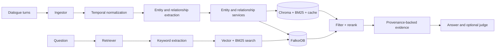

# GRACE-Mem

**Graph Retrieval with Agentic Corpus Evidence** is a research framework for
building and evaluating long-term conversational memory. It turns dialogue into
a temporal knowledge graph, retrieves graph-grounded evidence for later
questions, and ships reproducible pipelines for LoCoMo and LongMemEval.

[Quick start](#quick-start) | [Architecture](#architecture) |
[Benchmarks](#benchmark-pipelines) | [Core API](#core-api) |
[Documentation](#documentation)

## What This Repository Provides

- **Structured memory ingestion**: dialogue is compressed, temporally
  normalized, and extracted into entities and relationships with provenance.
- **Evidence-oriented retrieval**: vector search, BM25, graph traversal,
  filtering, reranking, and summary evidence are assembled into answer context.
- **Benchmark orchestration**: end-to-end ingest, retrieve, answer, judge, resume,
  and artifact-reuse workflows for LoCoMo and LongMemEval.
- **Agent Filter**: an optional post-retrieval GREP/READ/VECTOR layer that can
  verify, remove, or recover evidence before answer generation.

GRACE-Mem is currently a research codebase and benchmark runner. It is not a
hosted memory service or a published Python SDK.

## Architecture

The system has two primary flows that share the same graph, vector indexes, and
provenance model.



The dependency direction is intentionally one-way:

```text
CLI -> benchmark orchestration -> pipeline facades -> pipeline steps -> services
                                                          |             |
                                                          v             v
                                                     storage/graph     LLM
```

`KG/` never imports benchmark code from `experiment/`. The static import graph is
cycle-free, and runtime owners close graph, LLM, and dataset-local vector-store
resources explicitly.

## Quick Start

### Prerequisites

| Requirement | Supported use |
|---|---|
| Python 3.10-3.13 | Project runtime |
| [uv](https://docs.astral.sh/uv/) | Dependency and virtual environment management |
| OpenAI-compatible endpoint | Ingest, retrieval, answer generation, and judging |
| Docker | Optional when an external FalkorDB is already available |

The embedding and reranker models are downloaded locally during setup. A GPU is
recommended for benchmark runs.

### 1. Install and configure

```bash
git clone https://github.com/JaneDoe-0728/GRACE-Mem.git
cd GRACE-Mem
cp .env.example .env
```

Edit at least `LLM_API` and `MODEL_NAME` in `.env`. The defaults target a local
OpenAI-compatible endpoint at `http://localhost:1234/v1`. `JUDGE_LLM_API` and
`JUDGE_MODEL_NAME` may point to a separate judge. The bundled FalkorDB settings
work without changes when using `docker-compose.yml`.

Then run the setup script:

```bash
bash setup_env.sh
```

It performs `uv sync`, starts the primary FalkorDB container, downloads
`Qwen3-Embedding-0.6B` and `Qwen3-Reranker-0.6B`, and verifies the environment.

To manage FalkorDB manually:

```bash
docker compose up -d falkordb
docker compose logs -f falkordb
docker compose down
```

The primary database listens on port `6379`; its browser UI is available at
`http://localhost:3000`.

### 2. Add benchmark data

Benchmark data is not committed to this repository.

- LoCoMo expects `experiment/locomo/data/locomo10.json` (or `locomo.json`).
- LongMemEval expects the preprocessed per-question CSV layout under
  `experiment/longmem/script_data/<category>/`.

The repository does not currently include a raw LongMemEval-to-CSV converter.
Required files, columns, and overrides are documented in the
[experiment data guide](experiment/README.md#data-layout).

### 3. Run a benchmark

LoCoMo requires an explicit sample selection:

```bash
uv run python experiment/locomo/pipeline/runner.py \
  --dataset locomo \
  --sample-ids 0-9 \
  --run-tag my-run
```

LongMemEval selects one or more question categories:

```bash
uv run python experiment/longmem/pipeline/watchdog.py \
  --run-tag my-run \
  --type temporal_reasoning
```

Both commands run the default `ingest -> qa_eval -> judge` stage set. Stage
selection, resume behavior, retrieval-only runs, and output paths are covered in
the [experiment guide](experiment/README.md).

## Core API

Use `build_pipeline()` as a context manager so graph and LLM transports are
released deterministically:

```python
from KG.pipeline.factory import build_pipeline

with build_pipeline() as runtime:
    runtime.ingestor.summarize_and_ingest_turn(
        session_id=1,
        message_id=42,
        user_text="I attended an AI workshop yesterday.",
        assistant_text="What did you learn?",
        dialogue_datetime="2023/02/18 (Sat) 08:08",
    )

    context = runtime.retriever.build_kg_context(
        question="Which workshop did the user attend?",
        query_time="2023/02/18 (Sat) 08:08",
    )
    print(context)
```

`PipelineRuntime` exposes `retriever`, `ingestor`, `graph`, and `mgr` as
attributes and retains mapping-style access for older callers. The public flow is
small; implementation details live in the package documentation rather than in
this README.

## Benchmark Pipelines

| Benchmark | Entrypoint | Isolation unit | Default output |
|---|---|---|---|
| LoCoMo | `experiment/locomo/pipeline/runner.py` | One subprocess per sample | `experiment/locomo/output/standard/<run-tag>/` |
| LongMemEval | `experiment/longmem/pipeline/watchdog.py` | One artifact set per question CSV | `experiment/longmem/output/<run-tag>/<category>/` |

Both pipelines support:

- selecting a subset of samples or dataset IDs;
- running only selected stages;
- resuming incomplete work;
- reusing existing artifacts for retrieval-only evaluation;
- writing answer CSVs, checkpoints, logs, and aggregate metrics.

Experiment parameters are centralized in
[`experiment/experiment_config.py`](experiment/experiment_config.py):

- `REPRODUCIBILITY_PARAMS`: random seed and deterministic execution settings;
- `INGEST_PARAMS`: ingest mode, entity matching, LoCoMo chunking, and LongMem
  split-summary behavior;
- `RETRIEVAL_PARAMS`: initial search and post-filter thresholds/top-k values;
- `RERANKER_PARAMS`: graph filtering, reranking, evidence selection, and
  spreading-activation options;
- `GREP_AGENT_PARAMS`: optional Agent Filter behavior.

Artifact layout and retrieval configuration must stay aligned. LoCoMo stores one
summary entry per ingest chunk. LongMem can rebuild each summary into independent
`:u` and `:a` entries when `INGEST_PARAMS["use_split_summary"]` is enabled. The
experiment pipeline drives both writing and reading from this single setting; do
not override `split_single_entry_raw` independently.

## Storage and Runtime Data

Each run creates a self-contained artifact set that can include:

- Chroma collections for entities, relationships, and summaries;
- an entity BM25 index;
- entity and relationship caches plus metadata exports;
- a FalkorDB graph snapshot where the benchmark flow supports restore;
- JSONL retrieval/ingest traces, checkpoints, answer CSVs, and judge output.

Runtime artifacts and benchmark datasets are gitignored. The default core API
uses `KG/storage/artifacts`; benchmark pipelines create artifact directories under
their run output roots.

## Repository Map

```text
KG/
  pipeline/       Public ingest/retrieval facades and modular pipeline steps
  services/       Entity, relationship, and provenance domain operations
  storage/        Chroma, BM25, cache, and artifact lifecycle
  graph/          FalkorDB adapter and graph synchronization
  llm/            OpenAI-compatible client, token tracking, and prompts
  utils/          Temporal parsing, reranking, logging, and shared utilities
experiment/
  common/
    evaluation/  Shared judge, oracle, and scoring CLIs
    reproducibility.py
    run_metadata.py
  locomo/         LoCoMo orchestration, stages, artifacts, and analysis
  longmem/        LongMemEval processor, watchdog, rerun, and analysis tools
  agent_filter/   Post-retrieval evidence-refinement harness and replay tools
  noco/           Optional NocoDB upload helpers
  experiment_config.py
  __init__.py
  README.md
docs/             Refactor report requested during repository preparation
test/             Offline regression suite plus explicitly separated live probes
```

## Documentation

| Document | Purpose |
|---|---|
| [Experiment guide](experiment/README.md) | Data layout, benchmark commands, stages, outputs, and recovery |
| [Evaluation protocol](EVALUATION.md) | Standard judge model, voting rules, columns, commands, and scoring |
| [Agent Filter guide](experiment/agent_filter/README.md) | Evidence-refinement workflow and evaluation notes |
| [Test guide](test/README.md) | Offline suite, skips, expected failures, and manual probes |

## Validation

Run the deterministic offline suite and architecture gate before changing shared
behavior:

```bash
uv run pytest -q
uv run python -m tools.import_graph --check
```

The default pytest suite excludes nine explicitly listed live API/model probes.
Integration tests skip themselves when FalkorDB, an LLM endpoint, or model files
are unavailable. Known temporal parser gaps are recorded as narrow expected
failures instead of being hidden from collection.

## Current Limitations

- Benchmark datasets and generated artifacts are not distributed in the repo.
- LongMemEval requires the documented preprocessed CSV format; raw conversion is
  external to this project.
- End-to-end quality depends on the configured LLM, judge, embedding/reranker
  models, and benchmark-specific parameters.
- The default setup targets local research runs, not multi-tenant production
  deployment.
