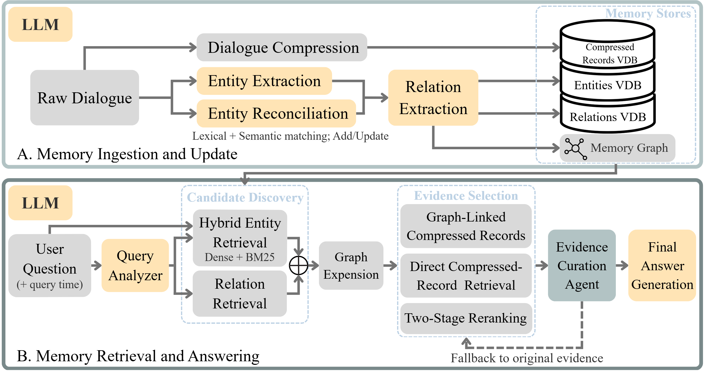
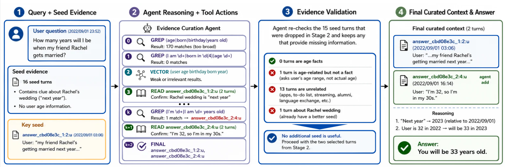

# GRACE-Mem

GRACE-Mem is a graph-based long-term conversational memory framework with
reproducibility-oriented pipelines for LoCoMo and LongMemEval.

[Overview](#overview) | [Architecture](#architecture) | [Quick Start](#quick-start) |
[Benchmarks](#benchmarks) | [Documentation](#documentation)

## Overview

GRACE-Mem builds persistent memory from dialogue so later questions can be
answered with retrieved evidence instead of relying only on the prompt window.
It is research software for memory experiments and retrieval diagnostics, not a
hosted memory service.

The memory stores compressed dialogue records, entities, relationships,
temporal information, and provenance links to source turns. A knowledge graph
connects facts that may be distributed across sessions, while vector and lexical
indexes provide semantic and exact-match discovery.

At query time, GRACE-Mem combines entity and relationship retrieval, graph
expansion, direct evidence retrieval, filtering, and reranking. The resulting
context can optionally pass through Agent Filter, which uses GREP, READ, and an
optional VECTOR search to refine evidence before answer generation.

## Architecture



The Evidence Curation Agent shown in the retrieval panel is optional; the
standard pipeline can send reranked evidence directly to answer generation.

- **Core (`KG/`)**: ingestion, retrieval, graph synchronization, storage, LLM
  access, temporal handling, and provenance.
- **Benchmarks (`experiment/`)**: LoCoMo and LongMemEval orchestration, shared
  judging/scoring, artifacts, and run metadata.
- **Optional tools**: Agent Filter, replay utilities, and offline diagnostics.

Dependency direction is one way:

```text
benchmarks / analysis / tools
        -> experiment orchestration
        -> KG pipeline facades
        -> KG services, storage, graph, and LLM utilities
```

The core `KG/` package does not depend on benchmark-specific code.

## Workflow

### Ingestion

```text
dialogue turns
  -> temporal normalization
  -> compression / summary representation
  -> entity extraction and reconciliation
  -> relationship extraction
  -> vector and BM25 storage
  -> FalkorDB graph synchronization
```

Stored evidence retains provenance back to source dialogue. Benchmark runs keep
artifacts and metadata so retrieval-only reruns can reuse a compatible ingest.

### Retrieval

```text
question + query time
  -> query analysis
  -> hybrid entity and relationship retrieval
  -> graph expansion and direct evidence retrieval
  -> filtering and reranking
  -> optional Agent Filter
  -> answer generation
```

## Key Features

- Graph-based conversational memory with temporal and provenance information.
- Hybrid dense and BM25 retrieval with graph expansion and reranking.
- Optional post-retrieval evidence verification and recovery.
- Staged LoCoMo and LongMemEval runners with reusable artifacts.
- Shared judge, scoring, oracle, and offline diagnostic entrypoints.

## Installation

### Requirements

- Python `3.10` through `3.13`.
- [uv](https://docs.astral.sh/uv/) for dependency management.
- An OpenAI-compatible endpoint for LLM-backed pipeline stages.
- FalkorDB, either from the included Docker Compose service or an external URI.
- Disk space for the Qwen embedding and reranker weights.

The lockfile currently selects PyTorch CUDA 12.8 wheels. A compatible NVIDIA
runtime is the documented setup; CPU-only installations must select an
appropriate PyTorch source before `uv sync`.

### Local FalkorDB Setup

This is the shortest complete setup when Docker is available:

```bash
git clone https://github.com/JaneDoe-0728/GRACE-Mem.git
cd GRACE-Mem
cp .env.example .env
# Edit .env and configure the LLM and judge endpoints.
bash tools/setup_env.sh
```

The script runs `uv sync`, starts the primary FalkorDB container, downloads the
pinned embedding and reranker snapshots, and verifies the database and model
files. The database listens on port `6379`; its browser UI is available at
`http://localhost:3000`.

### External FalkorDB Setup

Docker is not required when an existing FalkorDB instance is available:

```bash
git clone https://github.com/JaneDoe-0728/GRACE-Mem.git
cd GRACE-Mem
cp .env.example .env
# Set NEO4J_URI and the endpoint variables in .env.
uv sync
uv run python tools/download_models.py
```

## Configuration

Runtime endpoints belong in `.env`; experiment defaults belong in
[`experiment/experiment_config.py`](experiment/experiment_config.py).

### LLM

| Variable | Purpose |
|---|---|
| `LLM_API` | OpenAI-compatible base URL used by the KG and answer pipeline |
| `MODEL_NAME` | Model served by `LLM_API` |
| `JUDGE_LLM_API` | Base URL used by benchmark judging |
| `JUDGE_MODEL_NAME` | Judge model name |
| `GREP_AGENT_LLM_API` | Optional Agent Filter endpoint override |
| `GREP_AGENT_MODEL_NAME` | Optional Agent Filter model override |

The values in `.env.example` are local placeholders, not hosted services.

### FalkorDB

| Variable | Purpose |
|---|---|
| `NEO4J_URI` | FalkorDB Redis URI |
| `NEO4J_USERNAME` / `NEO4J_PASSWORD` | Graph connection credentials |
| `FALKORDB_PASSWORD` | Password used by the bundled container |
| `GRAPH_NAME` | FalkorDB graph key |

The historical `NEO4J_*` names are retained even though the active adapter is
FalkorDB.

### Embedding and Reranker

`tools/download_models.py` installs pinned snapshots of
`Qwen/Qwen3-Embedding-0.6B` and `Qwen/Qwen3-Reranker-0.6B` under `models/`.
`KG/embeddings.py` uses the local embedding path when available and otherwise
falls back to the Hugging Face model ID.

### Experiment Configuration

`experiment/experiment_config.py` centralizes reproducibility, ingest,
retrieval, reranker, and Agent Filter defaults. CLI flags are intended for run
selection, stage selection, artifact reuse, and output paths. See the
[experiment guide](experiment/README.md) for the supported interface.

## Quick Start

With FalkorDB and the configured LLM endpoint running, ingest one turn and
retrieve context:

```python
from KG.pipeline.factory import build_pipeline

with build_pipeline() as runtime:
    runtime.ingestor.summarize_and_ingest_turn(
        session_id=1,
        message_id=1,
        user_text="I attended an AI workshop yesterday.",
        assistant_text="What did you learn there?",
        dialogue_datetime="2023/02/18 (Sat) 08:08",
    )

    context = runtime.retriever.build_kg_context(
        question="Which workshop did the user attend?",
        query_time="2023/02/18 (Sat) 08:08",
    )
    print(context)
```

`build_pipeline()` owns the ingestor, retriever, graph client, vector stores,
and LLM client. Using it as a context manager closes owned resources.

## Benchmarks

Benchmark orchestration is separate from the core package. Both runners expose
the ordered stages `ingest`, `qa_eval`, and `judge`; use `--stage` for a subset
or `--artifact-dir` to reuse a compatible ingest.

Datasets are not bundled. Use the official sources:

- [LoCoMo dataset and benchmark](https://github.com/snap-research/locomo)
- [LongMemEval dataset and benchmark](https://github.com/xiaowu0162/LongMemEval)

Download the pinned LoCoMo release and the cleaned LongMemEval-S release, verify
their SHA-256 checksums, and convert LongMemEval into runner-ready CSVs:

```bash
uv run python -m tools.download_datasets --dataset all
```

Source JSON files and generated CSVs remain gitignored. Re-running the command
verifies existing files and skips a complete matching conversion.

### LoCoMo

The downloader places `locomo10.json` at
`experiment/locomo/data/locomo10.json`. Then run selected samples:

```bash
uv run python experiment/locomo/pipeline/runner.py \
  --dataset locomo \
  --sample-ids 0-9 \
  --run-tag my-run
```

### LongMemEval

The downloader converts each LongMemEval question to
`experiment/longmem/script_data/<category>/<question-id>.csv`. Run a category
after conversion:

```bash
uv run python experiment/longmem/pipeline/watchdog.py \
  --run-tag my-run \
  --type temporal_reasoning
```

The default is the cleaned `S` variant. The downloader also supports `M` and
`oracle` with `--longmem-variant`. Pinned revisions, checksums, the generated CSV
schema, output layout, and artifact compatibility rules are in the
[experiment guide](experiment/README.md).

### Evaluation

Use the shared post-hoc evaluation commands on completed runs:

```bash
uv run python experiment/common/evaluation/judge.py locomo <run-tag> --samples 0-9
uv run python experiment/common/evaluation/judge.py longmem <run-tag>
uv run python experiment/common/evaluation/score.py <run-tag>
```

See [EVALUATION.md](EVALUATION.md) for voting, abstention, output-column, and
oracle rules.

## Agent Filter



The IDs and evidence counts in this figure illustrate one trace; they are not
fixed pipeline invariants. The default retrieval and Agent Filter caps are
configured independently.

Agent Filter starts from an existing run's `Retrieved_Context`. It does not
rerun the full KG retrieval pipeline: GREP and READ inspect the question corpus,
while optional VECTOR performs a separate semantic search over the existing
summary VDB. Execution failures preserve the original context, but successful
refinement is not a guarantee that answer quality improves.

```bash
# LongMemEval
uv run python -m experiment.agent_filter.replay_run \
  --source-run <existing-run> --run-tag <agent-run> --workers 4

# LoCoMo
uv run python -m experiment.agent_filter.locomo_replay \
  --source-run <existing-run> --run-tag <agent-run> \
  --chunk-turns 8 --samples 0-9 --workers 4 --granularity turn
```

LongMem VECTOR discovery uses `LONGMEM_ARTIFACT_ROOT` or `--artifact-root`.
LoCoMo discovers its summary VDB under each source sample. See the
[Agent Filter guide](experiment/agent_filter/README.md) for defaults,
adjudication scope, scoring, and trace inspection.

## Analysis and Validation

Offline analysis lives under each benchmark's `analysis/` package. Some tools
only read artifacts; others call an LLM or launch benchmark subprocesses. Check
each entrypoint's `--help` and the runtime matrix in the
[experiment guide](experiment/README.md#offline-analysis) before running it.

The tracked regression suite is designed to run without API credentials, model
weights, or a live database:

```bash
uv run pytest -q
```

Optional integration behavior is skipped when its declared prerequisites are
unavailable. Expected failures record known temporal parser limitations; see
[tests/README.md](tests/README.md) for result semantics.

## Repository Structure

```text
GRACE-Mem/
├── KG/                         # core ingestion, retrieval, graph, storage, and LLM code
├── experiment/
│   ├── common/                 # shared evaluation and run helpers
│   ├── locomo/                 # LoCoMo pipeline and analysis
│   ├── longmem/                # LongMemEval pipeline and analysis
│   └── agent_filter/           # optional evidence refinement
├── docs/architecture/          # architecture figures
├── tests/                      # offline regression suite
├── tools/                      # setup, model, trace, and maintenance utilities
├── EVALUATION.md
├── pyproject.toml
└── uv.lock
```

Datasets, generated artifacts, model weights, logs, secrets, and manual live
probes are intentionally excluded from version control.

## Reproducibility

The benchmark layer centralizes settings and writes run metadata alongside
artifacts, checkpoints, logs, answers, and judge output. Dataset downloads,
embedding weights, and reranker weights use immutable revisions and checksums.
The LongMem converter writes a source manifest and one deterministic CSV per
question.

Exact results can still vary with the answer/judge endpoint and model revision,
hardware, experiment configuration, and external service behavior. This
repository currently provides no canonical paper configuration or
expected-score table; do not interpret a successful run as an exact reproduction
of an unpublished reference score.

## Documentation

| Document | Purpose |
|---|---|
| [Experiment guide](experiment/README.md) | Data layout, commands, artifacts, and analysis requirements |
| [Evaluation protocol](EVALUATION.md) | Judge, voting, scoring, abstention, and oracle behavior |
| [Agent Filter guide](experiment/agent_filter/README.md) | Evidence refinement, VECTOR, adjudication, and traces |
| [Test guide](tests/README.md) | Automated suite, skips, expected failures, and manual-probe policy |
| [.env example](.env.example) | Runtime endpoint and graph configuration |

## Release Status

- No repository license is currently present. Until one is added, normal
  copyright restrictions apply to reuse and redistribution.
- No official GRACE-Mem paper citation has been provided in this repository.
- A canonical paper configuration and expected-score table have not yet been
  published for exact result comparison.
