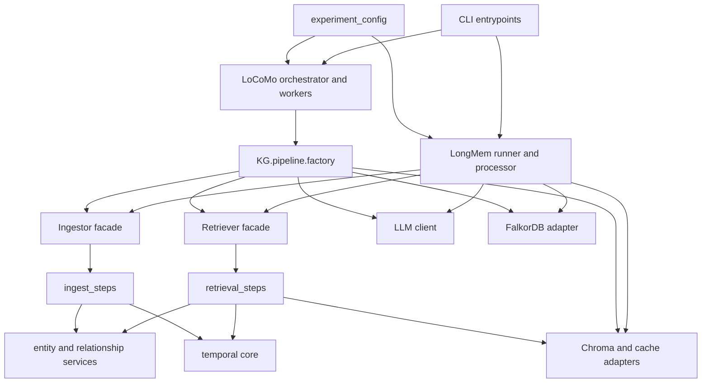

# Import Dependency Baseline

This document records the dependency shape enforced during the package refactor.
Generate the current counts and cycle report with:

```bash
uv run python -m tools.import_graph --check
```

## Current Flow



LoCoMo uses the composition factory. LongMem has benchmark-specific composition
roots with typed dataset configuration and context-managed ownership of graph,
LLM, and vector-store resources. Shared experiment parameters remain mutable
dictionaries and concrete adapters still read connection settings from the
environment.

## Current Findings

- 182 modules and 374 package-local import edges across `KG` and `experiment`.
- 73 `experiment -> KG` edges, which follow the intended outer-to-core direction.
- No `KG -> experiment` reverse dependencies remain.
- No circular dependencies remain in the static project graph.
- Package imports do not mutate `sys.path`; direct-file CLI compatibility is
  isolated to guarded bootstraps.
- Nine manual network/model probes are explicitly excluded from automated pytest
  collection. No missing production contract is hidden by the collection policy.

The dependency direction and canonical package imports are locked by
`test/test_architecture.py`. Fresh-interpreter import tests complement the AST
graph because importing a submodule executes each parent package's `__init__.py`.
The offline/manual boundary and result categories are documented in
`test/README.md`.

## Runtime Ownership

- `PipelineRuntime` owns the LoCoMo graph and LLM transports.
- `MultiDatasetProcessor` owns LongMem shared transports and closes each
  dataset-local `VDBManager` during teardown.
- `LongMemRerun` owns rerun/watchdog transports and rolls back partial startup.
- Dataset logger monkeypatches are scoped and restored in reverse order.

## Cycles Removed

1. `LLMClient <-> EntityOpsProcessor`

   Token tracking was owned by `LLMClient`, so `EntityOpsProcessor` imported the
   client module to propagate thread context. Token tracking now lives in
   `KG.llm.token_tracking`, which both modules depend on independently.

2. `longmem.helpers.progress <-> longmem.utils.io`

   The generic IO module contained a progress-specific compatibility function.
   The watchdog now calls the progress helper directly, leaving IO as the lower
   level dependency.

3. `locomo.aggregate <-> locomo.stages.upload`

   Summary calculations now live in `experiment.locomo.summary`. Aggregation and
   upload both depend on that neutral module.

4. `locomo.helpers <-> locomo.snapshot`

   Snapshot code now imports dataset helpers from their owning module and calls
   snapshot-owned functions directly instead of routing through the helper facade.

5. `locomo.snapshot -> locomo.helpers.__init__ -> locomo.snapshot`

   This package-initialization cycle was invisible to the original AST graph.
   Internal modules now import owners directly, and the compatibility facade
   resolves exports lazily.

## Target Direction

```text
CLI -> benchmark orchestration -> application facades -> pipeline steps -> ports
                                                               ^
                                                               |
                                    composition root -> concrete adapters
```

Core modules must not import benchmark modules, environment-specific composition,
or CLI code. Concrete FalkorDB, Chroma, OpenAI-compatible clients, and environment
loading remain at the outer adapter/composition boundary.
