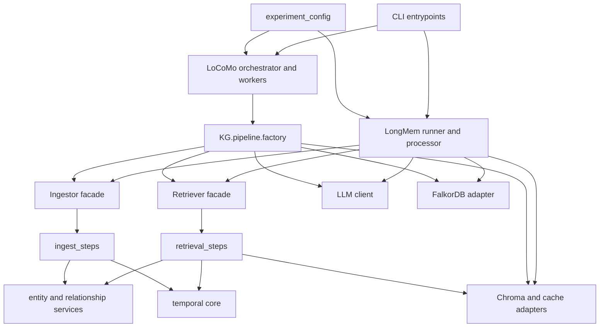

# Import Dependency Baseline

This document records the dependency shape enforced during the package refactor.
Generate the current counts and cycle report with:

```bash
uv run python -m tools.import_graph --check
```

## Current Flow



LoCoMo uses the composition factory, while LongMem still constructs most runtime
components directly. Configuration is passed as mutable dictionaries and is also
read from environment variables by concrete adapters.

## Current Findings

- 181 modules and 381 package-local import edges across `KG` and `experiment`.
- 77 `experiment -> KG` edges, which follow the intended outer-to-core direction.
- No `KG -> experiment` reverse dependencies remain.
- No circular dependencies remain in the static project graph.
- Manual network/model scripts are excluded from automated pytest collection.

The dependency direction and canonical package imports are locked by
`test/test_architecture.py`.

## Cycles Removed

1. `LLMClient <-> EntityOpsProcessor`

   Token tracking was owned by `LLMClient`, so `EntityOpsProcessor` imported the
   client module to propagate thread context. Token tracking now lives in
   `KG.llm.token_tracking`, which both modules depend on independently.

2. `longmem.helpers.progress <-> longmem.utils.io`

   The generic IO module contained a progress-specific compatibility function.
   The watchdog now calls the progress helper directly, leaving IO as the lower
   level dependency.

3. `locomo.aggregate <-> locomo.stages.upload`

   Summary calculations now live in `experiment.locomo.summary`. Aggregation and
   upload both depend on that neutral module.

4. `locomo.helpers <-> locomo.snapshot`

   Snapshot code now imports dataset helpers from their owning module and calls
   snapshot-owned functions directly instead of routing through the helper facade.

## Target Direction

```text
CLI -> benchmark orchestration -> application facades -> pipeline steps -> ports
                                                               ^
                                                               |
                                    composition root -> concrete adapters
```

Core modules must not import benchmark modules, environment-specific composition,
or CLI code. Concrete FalkorDB, Chroma, OpenAI-compatible clients, and environment
loading remain at the outer adapter/composition boundary.
